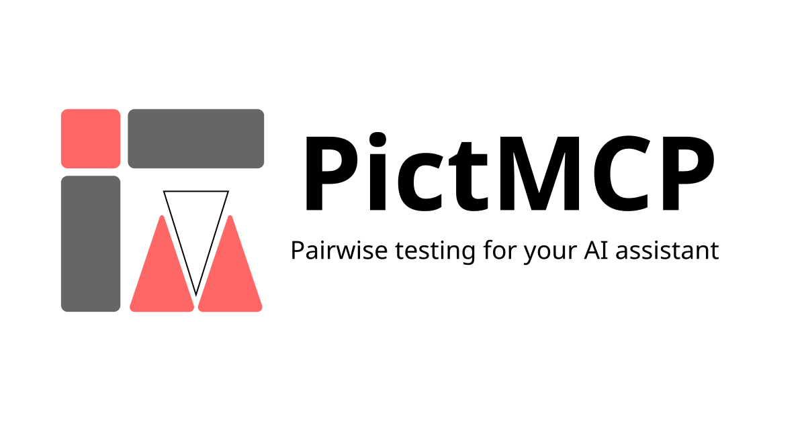

# PictMCP

<p align="center">
  
</p>

## 🚧 Work in Progress 🚧

> [!WARNING]
> This project is currently under active development.
> It is not yet stable and its API and features may change without notice.
>
> Use in production environments is **not recommended** at this time.

## Overview

PictMCP is a MCP (Model Context Protocol) server that provides pairwise combinatorial testing capabilities to AI assistants. It wraps the [PICT (Pairwise Independent Combinatorial Testing)](https://github.com/microsoft/pict) algorithm via WebAssembly, enabling AI clients to generate optimized test case combinations.

### Why need this?

- **LLMs struggle with strict algorithmic data processing** - Combinatorial test generation requires precise mathematical algorithms that LLMs cannot reliably execute
- **Offload complex logic** - This tool handles the combinatorial logic that LLMs handle poorly, allowing them to focus on test design and interpretation

## Features

- 🔒 **Local Processing** - All processing runs locally with no external network calls
- ⚡ **WebAssembly Powered** - Fast execution using the PICT algorithm compiled to WebAssembly
- 🔗 **Constraint Support** - Define constraints to filter out invalid parameter combinations
- 📊 **Structured Output** - Returns well-structured JSON results for easy integration

## Installation

### Prerequisites

- [Node.js](https://nodejs.org/) (v24 or higher)

### MCP Client Configuration

Add the following configuration to your MCP client. This is an example configuration; the exact format may vary depending on your client. Please refer to your MCP client's documentation for details.

```json
{
  "mcpServers": {
    "PictMCP": {
      "command": "npx",
      "args": ["pictmcp"]
    }
  }
}
```

## Quick Start

Once installed, you can ask your AI assistant to generate test cases using pairwise combinatorial testing.

### Example Prompt

> Generate test cases for a login form with the following parameters:
>
> - Browser: Chrome, Firefox, Safari
> - OS: Windows, macOS, Linux
> - Language: English, Japanese, Spanish

The AI assistant will use the `generate-test-cases` tool to create an optimized set of test cases that covers all pairwise combinations.

### Example with Constraints

> Generate test cases for:
>
> - Browser: Chrome, Firefox, Safari, Edge
> - OS: Windows, macOS, Linux
> - With constraint: Safari only works on macOS

The tool supports PICT constraint syntax to exclude invalid combinations.

## FAQ

### Does this communicate with external servers?

No. All processing runs locally with no external network calls.

### I already use the `pict` CLI. Do I need this?

If your AI agent can execute CLI commands directly, you may not need this tool. However, PictMCP provides:

- A standardized MCP interface for AI assistants
- No need to install PICT separately (WebAssembly-based)
- Structured JSON output instead of TSV

### What is pairwise testing?

Pairwise testing (also known as all-pairs testing) is a combinatorial testing method that generates test cases covering all possible pairs of input parameters. This significantly reduces the number of test cases while maintaining high defect detection rates.

### What constraint syntax is supported?

PictMCP supports the full PICT constraint syntax. See the [PICT documentation](https://github.com/microsoft/pict/blob/main/doc/pict.md) for details.

## License

This project is licensed under the MIT License—see the [LICENSE](./LICENSE) file for details.
